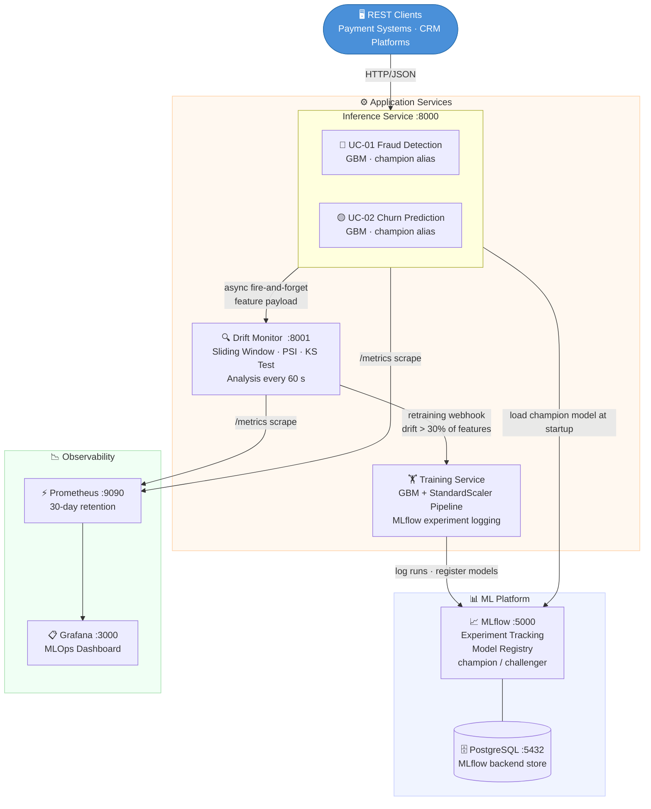
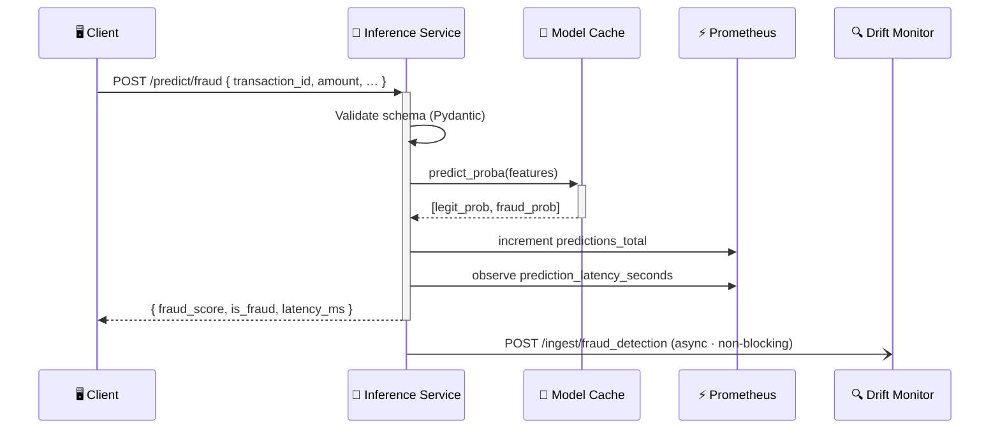
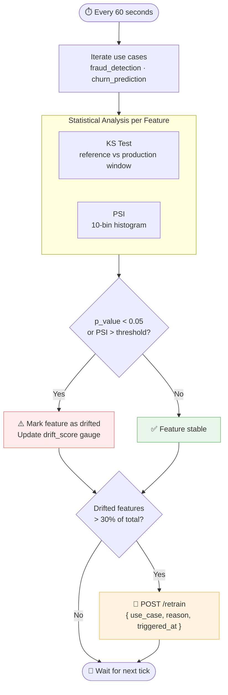
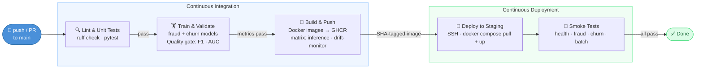

<p align="center">
  <a href="https://gentai.io">
    
  </a>
</p>

<p align="center">
  An open-source project by <a href="https://gentai.io"><strong>Gentai</strong></a> &nbsp;·&nbsp; Started by <strong>Andy — Juan Andres Mercado</strong>
</p>

---

# MLOps PoC

A production-grade MLOps reference implementation demonstrating end-to-end machine learning lifecycle management: from experiment tracking and model training to real-time inference, statistical drift detection, and automated retraining pipelines.

Built with **FastAPI**, **MLflow**, **Prometheus**, **Grafana**, and **Docker Compose** — deployable on any Linux host in under five minutes.

---

## Table of Contents

- [Overview](#overview)
- [Architecture](#architecture)
- [Use Cases](#use-cases)
- [Tech Stack](#tech-stack)
- [Getting Started](#getting-started)
- [API Reference](#api-reference)
- [CI/CD Pipeline](#cicd-pipeline)
- [Monitoring & Observability](#monitoring--observability)
- [Configuration](#configuration)
- [Project Structure](#project-structure)
- [Contributing](#contributing)
- [License](#license)

---

## Overview

This proof-of-concept implements the full MLOps lifecycle across two real-world use cases:

| Use Case | Description | SLA |
|---|---|---|
| **UC-01 — Fraud Detection** | Real-time transaction scoring with binary classification | < 200ms p99 |
| **UC-02 — Churn Prediction** | Customer segmentation with CRM action recommendations | < 500ms p99 |

Key capabilities:

- **Experiment Tracking** — All training runs are logged to MLflow with parameters, metrics, and artifacts
- **Model Registry** — Champion/challenger model versioning via MLflow Model Registry aliases
- **Real-time Serving** — FastAPI inference service with in-memory model cache and async background tasks
- **Drift Detection** — Statistical monitoring using Population Stability Index (PSI) and Kolmogorov–Smirnov tests
- **Automated Retraining** — Drift alerts trigger retraining webhooks when > 30% of features drift
- **Observability** — Prometheus metrics scraped from all services, visualized in Grafana dashboards
- **CI/CD** — GitHub Actions pipeline: lint → train → validate metrics → build images → deploy → smoke test

---

## Architecture

### System Overview



### Data Flow — Real-time Inference



### Drift Detection Flow



---

## Use Cases

### UC-01 — Fraud Detection

Classifies individual payment transactions as fraudulent or legitimate in real time.

**Input features:**

| Feature | Type | Description |
|---|---|---|
| `amount` | float | Transaction amount (USD) |
| `hour_of_day` | int | Hour the transaction occurred (0–23) |
| `day_of_week` | int | Day of week (0=Monday, 6=Sunday) |
| `distance_from_home_km` | float | Distance from cardholder's home address |
| `is_foreign` | bool | Whether transaction is outside home country |
| `previous_30d_avg` | float | Cardholder's average transaction in last 30 days |
| `velocity_1h` | int | Number of transactions in the last hour |

**Output:** fraud score (0–1), binary flag, model version, latency ms

**Quality gates (CI):** F1 ≥ 0.70 · AUC ≥ 0.80

---

### UC-02 — Churn Prediction

Scores customer churn probability and returns a recommended CRM action segmented by risk level.

**Input features:**

| Feature | Type | Description |
|---|---|---|
| `tenure_days` | int | Days since customer acquisition |
| `monthly_charges` | float | Current monthly billing amount |
| `total_charges` | float | Lifetime revenue from customer |
| `num_products` | int | Number of active products/subscriptions |
| `support_tickets_90d` | int | Support tickets filed in last 90 days |
| `last_login_days_ago` | int | Days since last platform login |
| `nps_score` | float | Net Promoter Score (0–10) |

**Segments and actions:**

| Probability | Segment | Recommended Action |
|---|---|---|
| ≥ 0.70 | `high_risk` | Immediate retention call + 30% discount offer |
| 0.40–0.70 | `medium_risk` | Personalized email campaign + loyalty points |
| < 0.40 | `low_risk` | Standard NPS survey |

**Quality gates (CI):** F1 ≥ 0.65 · AUC ≥ 0.75

---

## Tech Stack

| Component | Technology | Version |
|---|---|---|
| Inference API | FastAPI + Uvicorn | Latest |
| Drift Monitor | FastAPI + SciPy | Latest |
| ML Framework | scikit-learn | Latest |
| Experiment Tracking | MLflow | 2.13.0 |
| Model Registry | MLflow | 2.13.0 |
| Metadata Store | PostgreSQL | 16 |
| Metrics | Prometheus | 2.51.0 |
| Dashboards | Grafana | 10.4.0 |
| Containerization | Docker Compose | v2 |
| Linting | Ruff | Latest |
| CI/CD | GitHub Actions | — |
| Runtime | Python | 3.11 |

---

## Getting Started

### Prerequisites

- Docker ≥ 24 and Docker Compose v2
- Git
- 4 GB RAM available for the full stack

### Quick Start

```bash
# Clone the repository
git clone https://github.com/Gentai-Tech-Partner/mlops-poc.git
cd mlops-poc

# Start all services
docker compose up -d

# Wait for MLflow to become healthy (~30s), then train both models
docker compose exec training python train.py fraud_detection
docker compose exec training python train.py churn_prediction
```

| Service | URL | Credentials |
|---|---|---|
| Inference API | http://localhost:8000/docs | — |
| Drift Monitor | http://localhost:8001/docs | — |
| MLflow | http://localhost:5000 | — |
| Prometheus | http://localhost:9090 | — |
| Grafana | http://localhost:3000 | admin / admin |

### Test a Fraud Prediction

```bash
curl -s -X POST http://localhost:8000/predict/fraud \
  -H "Content-Type: application/json" \
  -d '{
    "transaction_id": "txn-001",
    "amount": 9500.00,
    "merchant_category": "electronics",
    "hour_of_day": 3,
    "day_of_week": 6,
    "distance_from_home_km": 450.0,
    "is_foreign": true,
    "previous_30d_avg": 120.0,
    "velocity_1h": 4
  }' | python -m json.tool
```

### Test a Churn Prediction

```bash
curl -s -X POST http://localhost:8000/predict/churn \
  -H "Content-Type: application/json" \
  -d '{
    "customer_id": "cust-001",
    "tenure_days": 90,
    "monthly_charges": 89.99,
    "total_charges": 810.00,
    "num_products": 1,
    "support_tickets_90d": 8,
    "last_login_days_ago": 45,
    "nps_score": 3.5,
    "contract_type": "monthly"
  }' | python -m json.tool
```

### Run Smoke Tests

```bash
pip install httpx
python scripts/smoke_test.py
```

### Stop and Clean Up

```bash
docker compose down -v   # removes volumes (MLflow data, Prometheus data)
```

---

## API Reference

Full interactive documentation is available at `http://localhost:8000/docs` (Swagger UI) and `http://localhost:8000/redoc` (ReDoc) when the inference service is running.

### Endpoints Summary

| Method | Path | Description |
|---|---|---|
| `POST` | `/predict/fraud` | Single transaction fraud scoring |
| `POST` | `/predict/fraud/batch` | Batch fraud scoring (max 500) |
| `POST` | `/predict/churn` | Single customer churn scoring |
| `POST` | `/models/reload` | Hot-reload models from registry |
| `GET` | `/health` | Service health + loaded model versions |
| `GET` | `/metrics` | Prometheus metrics endpoint |

### Drift Monitor Endpoints

| Method | Path | Description |
|---|---|---|
| `POST` | `/ingest/{use_case}` | Receive feature data from inference |
| `GET` | `/drift/{use_case}` | Current drift report per feature |
| `GET` | `/health` | Service health + window sizes |
| `GET` | `/metrics` | Prometheus metrics endpoint |

### Response Example — Fraud Prediction

```json
{
  "transaction_id": "txn-001",
  "fraud_score": 0.9341,
  "is_fraud": true,
  "model_version": "3",
  "latency_ms": 12.48,
  "timestamp": "2026-05-19T14:22:01.123456"
}
```

### Response Example — Churn Prediction

```json
{
  "customer_id": "cust-001",
  "churn_probability": 0.7823,
  "churn_segment": "high_risk",
  "recommended_action": "Immediate retention call + 30% discount offer",
  "model_version": "2",
  "timestamp": "2026-05-19T14:22:03.456789"
}
```

---

## CI/CD Pipeline

The GitHub Actions workflow (`.github/workflows/ci-cd.yml`) implements a multi-stage pipeline that blocks deployment when quality gates fail.



### Required GitHub Secrets

| Secret | Description |
|---|---|
| `STAGING_HOST` | Staging server IP or hostname |
| `STAGING_USER` | SSH username |
| `STAGING_SSH_KEY` | Private SSH key for deployment |
| `STAGING_INFERENCE_URL` | Base URL for smoke tests (e.g., `http://staging-host:8000`) |

---

## Monitoring & Observability

### Prometheus Metrics

All services expose a `/metrics` endpoint scraped by Prometheus every 15 seconds.

| Metric | Type | Labels | Description |
|---|---|---|---|
| `mlops_predictions_total` | Counter | `use_case`, `result` | Total predictions served |
| `mlops_prediction_latency_seconds` | Histogram | `use_case` | End-to-end inference latency |
| `mlops_fraud_score_last` | Gauge | — | Last returned fraud score |
| `mlops_churn_score_last` | Gauge | — | Last returned churn probability |
| `mlops_model_version_info` | Gauge | `use_case`, `version` | Currently loaded model version |
| `mlops_drift_score` | Gauge | `use_case`, `feature` | Current PSI score per feature |
| `mlops_drift_alerts_total` | Counter | `use_case` | Total drift alerts triggered |
| `mlops_retraining_triggers_total` | Counter | `use_case` | Total retraining jobs triggered |

### Grafana Dashboard

Import the pre-provisioned dashboard at `infra/grafana/dashboards/mlops-dashboard.json`. It includes:

- Prediction throughput (RPS per use case)
- Latency percentiles (p50, p95, p99)
- Fraud score distribution over time
- Churn segment breakdown
- Drift scores per feature
- Retraining trigger history

### Drift Detection

The drift monitor analyzes feature distributions using two complementary statistical tests:

- **PSI (Population Stability Index)** — measures distribution shift across histogram bins
  - PSI < 0.10: no significant drift
  - PSI 0.10–0.20: moderate drift, monitor closely
  - PSI > 0.20: significant drift, retraining recommended
- **Kolmogorov–Smirnov test** — p-value < 0.05 flags distribution mismatch

A retraining webhook is triggered when more than 30% of a model's features are flagged as drifted.

---

## Configuration

### Environment Variables

| Variable | Service | Default | Description |
|---|---|---|---|
| `MLFLOW_TRACKING_URI` | training, inference, drift-monitor | `http://mlflow:5000` | MLflow server URL |
| `FRAUD_MODEL_ALIAS` | inference | `champion` | MLflow alias for fraud model |
| `CHURN_MODEL_ALIAS` | inference | `champion` | MLflow alias for churn model |
| `DRIFT_THRESHOLD` | drift-monitor | `0.2` | PSI threshold to flag drift |
| `WINDOW_SIZE` | drift-monitor | `500` | Sliding window size (# of predictions) |
| `RETRAINING_WEBHOOK` | drift-monitor | `http://training:8002/retrain` | Retraining trigger URL |

### Scaling Notes

- **Inference**: CPU-bound at inference time. Scale horizontally behind a load balancer. Resource limits: 1 vCPU / 512 MB RAM per replica.
- **Drift Monitor**: Memory-bound by sliding window size. `WINDOW_SIZE=500` uses ~5 MB per use case.
- **MLflow**: Bottleneck at high artifact upload rates. Use S3/GCS as artifact store in production.
- **PostgreSQL**: Sufficient for metadata. Add a read replica if MLflow query load becomes a bottleneck.

---

## Project Structure

```
mlops-poc/
├── .github/
│   └── workflows/
│       └── ci-cd.yml              # GitHub Actions pipeline
├── infra/
│   ├── grafana/
│   │   ├── dashboards/
│   │   │   └── mlops-dashboard.json
│   │   └── datasources.yml        # Prometheus datasource provisioning
│   └── prometheus/
│       └── prometheus.yml         # Scrape configs for all services
├── scripts/
│   ├── smoke_test.py              # Post-deploy end-to-end tests
│   └── validate_model_metrics.py  # CI quality gate (F1/AUC thresholds)
├── services/
│   ├── drift-monitor/
│   │   ├── Dockerfile
│   │   ├── main.py                # PSI + KS drift detection, FastAPI
│   │   └── requirements.txt
│   ├── inference/
│   │   ├── Dockerfile
│   │   ├── main.py                # FastAPI serving, Prometheus metrics
│   │   └── requirements.txt
│   └── training/
│       ├── Dockerfile
│       ├── train.py               # GBM training, MLflow logging
│       └── requirements.txt
├── shared/
│   └── schemas/
│       └── events.py              # Pydantic models shared across services
├── docker-compose.yml             # Full local stack definition
└── README.md
```

---

## Contributing

Contributions are welcome. Please follow these steps:

1. Fork the repository and create a feature branch: `git checkout -b feat/your-feature`
2. Make your changes and ensure all quality checks pass:
   ```bash
   pip install ruff pytest
   ruff check services/ shared/
   pytest tests/ -v
   ```
3. Open a pull request against `main` with a clear description of the change and its motivation.

### Development Guidelines

- Keep services independent — cross-service communication only via HTTP (REST) or the shared Pydantic schemas in `shared/schemas/`
- All new models must be registered in the MLflow Model Registry with a `champion` alias before inference picks them up
- New Prometheus metrics must follow the `mlops_` prefix convention
- CI pipeline must remain green before merging

---

## License

This project is licensed under the MIT License — see the [LICENSE](LICENSE) file for details.

---

<p align="center">
  <a href="https://gentai.io">
    
  </a><br><br>
  Built and open-sourced by <a href="https://gentai.io"><strong>Gentai</strong></a>.<br>
  Project initiated by <strong>Andy — Juan Andres Mercado</strong>.<br>
  Contributions, issues, and feedback are welcome.
</p>
